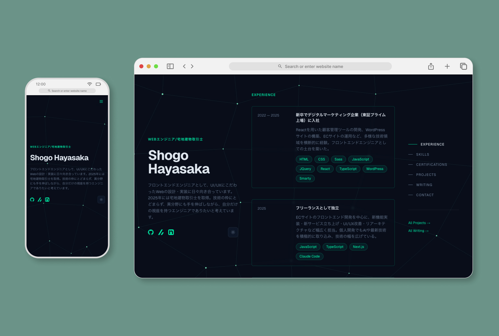

# Portfolio — Shogo Hayasaka

個人ポートフォリオサイト。Next.js 16 App Router + React 19 + TypeScript で構築。
https://portfolio-shogo-hayasaka.vercel.app/



## 技術スタック

- **Framework**: Next.js 16 (App Router)
- **Language**: TypeScript / React 19
- **Styling**: Tailwind CSS v4
- **3D**: Three.js + react-three/fiber
- **Animation**: framer-motion v12 / Lenis (慣性スクロール)
- **CMS**: microCMS
- **Font**: Geist Sans / Geist Mono

## 開発環境のセットアップ

```bash
npm run dev      # 開発サーバー起動 (http://localhost:3000)
npm run build    # 本番ビルド
npm run lint     # ESLint 実行
npm run start    # 本番サーバー起動（要ビルド）
```

## 環境変数

`.env.local` に以下を設定：

```
MICROCMS_SERVICE_DOMAIN=your-service-domain
MICROCMS_API_KEY=your-api-key
SLACK_WEBHOOK_URL=your-webhook-url   # コンタクトフォーム、slack通知用
```

## ディレクトリ構成

```
app/
  layout.tsx            — ルートレイアウト
  page.tsx              — トップページ
  globals.css           — CSS変数・ベーススタイル
  projects/page.tsx     — プロジェクト一覧
  writing/page.tsx      — 記事一覧
  api/contact/route.ts  — コンタクトフォーム API

components/
  background/           — Three.js 3D背景（IcosahedronBackground）
  layout/               — PageLayout / HeroPanel / NavPanel / MobileMenu / Footer
  sections/             — Experience / Skills / Certifications / Projects / Writing / Contact
  projects/             — ProjectGrid / ProjectLinkButton
  writing/              — WritingGrid
  ui/                   — Badge / SectionLabel / SlideButton

lib/
  types.ts              — 型定義
  microcms.ts           — microCMS クライアント
  data.ts               — データフェッチ関数
  contactSchema.ts      — Zod バリデーション
```

## ページ構成

| ページ | レイアウト |
|---|---|
| `/` | 3カラム固定（左Hero・中央コンテンツ・右ナビ） |
| `/projects` | 独立レイアウト・lg:3カラムグリッド |
| `/writing` | 独立レイアウト・sm:2カラムカードグリッド |

## 実装のポイント

### 1. 3D背景 + オープニングシーケンス
Three.js + react-three/fiber で正二十面体の3Dシーンを実装。初回訪問時のみ「タイピングアニメーション → ブルーム展開 → ページフェードイン」のシーケンスを実行し、`sessionStorage` フラグで再訪問時はスキップする（UX改善）。
- `components/background/IcosahedronBackground.tsx`

### 2. SSR / Hydration 対策
Three.js・next-themes・モーダルはすべてクライアント専用のため、`BackgroundWrapper.tsx` で `dynamic(() => import(...), { ssr: false })` を使用。マウント検知に `useEffect + useState` ではなく `useSyncExternalStore` を採用し、ハイドレーションミスマッチを防止。
- 対象: `ThemeToggle.tsx` / `IcosahedronBackground.tsx` / `Contact.tsx`

### 3. Lenis + カスタムイベントによるスクロール制御
Lenis（慣性スクロール）をアプリ全体に適用し、モーダル・メニュー開閉時は `window.dispatchEvent(new Event("lenis:stop/lenis:start"))` で外部制御。`body.overflow: hidden` と併用して二重制御し、モーダル内のスクロールは `wheel` イベントの `stopPropagation()` でバイパス。
- 対象: `SmoothScroll.tsx` / `MobileMenu.tsx` / `Contact.tsx` / `IcosahedronBackground.tsx`

### 4. next-themes + CSS変数によるテーマ管理
`<ThemeProvider attribute="class">` で `<html>` に `class="dark/light"` を付与し、Tailwind の `dark:` バリアントを使わず CSS変数（`:root` / `.light`）で一元管理。全コンポーネントで `style={{ color: "var(--accent)" }}` パターンに統一。
- 対象: `app/globals.css` / `ThemeToggle.tsx`

### 5. microCMS 遅延クライアント生成 + レスポンス正規化
`getClient()` 関数でリクエスト時にSDKクライアントを生成し、ビルド時の環境変数チェックをバイパス。APIレスポンスの `{fieldId, name}[]` → `string[]`、空文字 → `undefined` への正規化をデータ層で統一。
- 対象: `lib/microcms.ts` / `lib/data.ts`

### 6. Zod スキーマのクライアント・サーバー共有
`lib/contactSchema.ts` の単一スキーマを、クライアント側のリアルタイム個別バリデーション（onBlur）とサーバー側の統括バリデーション（API Route）の両方で共有。
- 対象: `lib/contactSchema.ts` / `components/sections/Contact.tsx` / `app/api/contact/route.ts`

### 7. framer-motion の whileInView パターン
全セクションコンポーネントで `initial={{ opacity: 0, y: 16 }} whileInView={{ opacity: 1, y: 0 }} viewport={{ once: true }}` を統一適用。モーダルには `AnimatePresence` + `exit` アニメーション、送信完了後のチェックマークには `spring` アニメーションを使用。
